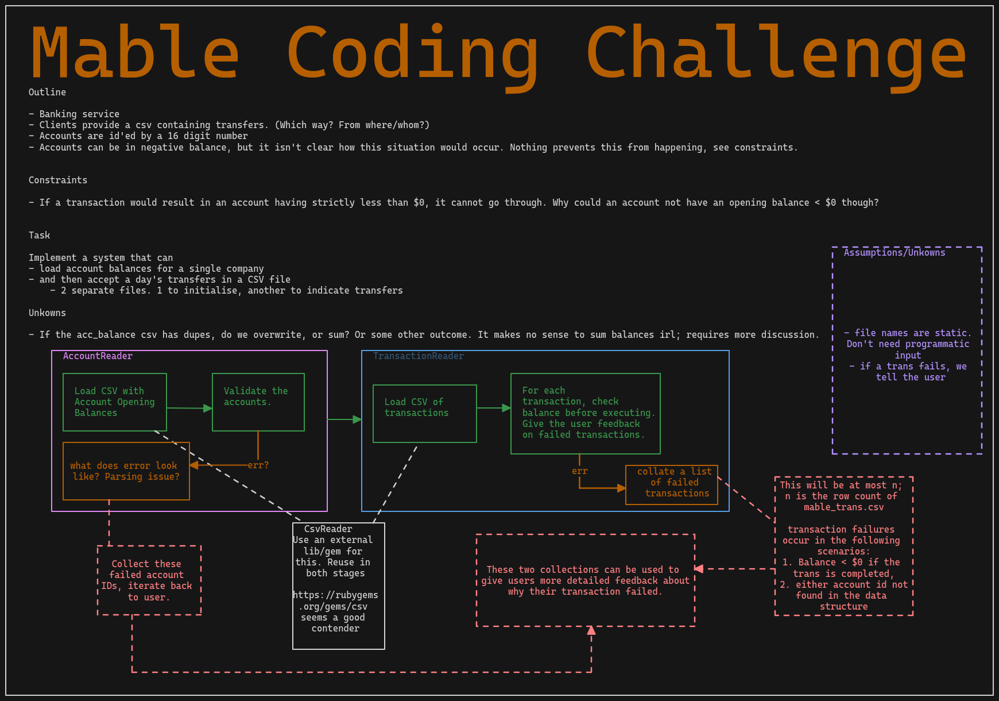

## Usage

## Structure

The code is contained in `simple_banking` and structured as a gem created by running `bundler gem simple_banking`.

Tests are in the `spec` sub directory of `simple_banking` and are split by module.

## Assumptions/Tidbits

As I am not super familir with the Ruby language. As such I have taken some liberties in my implementation, and coming from an Elixir background, I am tempted to reach for the tuple data structure.

It should be noted that some of the methods, and error handling in particular, are quite improper. In Elixir, a function can simply return an `{:error, message}` tuple and rely on the calling code to handle such a case, and this tendency may bleed through in my solution here.
