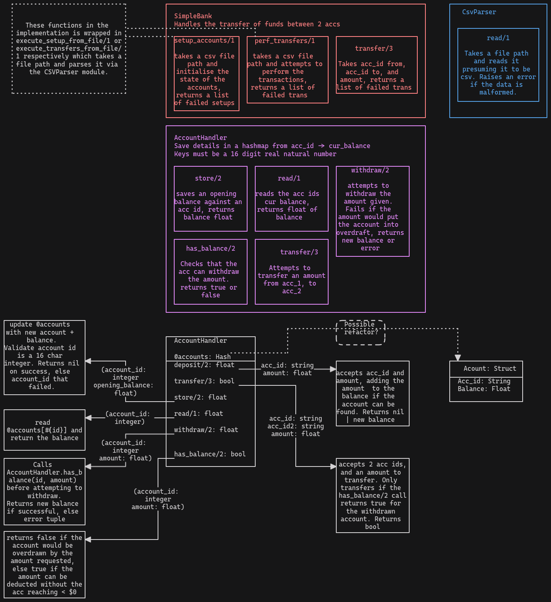

# Overview

## Functions

The above diagram illustrates the functions and their params + return types.
There are a couple of implementation changes between the diagram and the resultant code.

## Usage

`irb ./run_script.rb` from within the project root.

## Structure

The code is contained in `lib/simple_banking` and structured as a gem created by running `bundler gem simple_banking`.

Tests are in the `spec` sub directory of `simple_banking` and are split by module.

## Caveats

I've decided to write this in Ruby, but having very limited experience with Ruby this has been something of a learning exercise. That being said, there is probably a lot of habits from writing Elixir.
